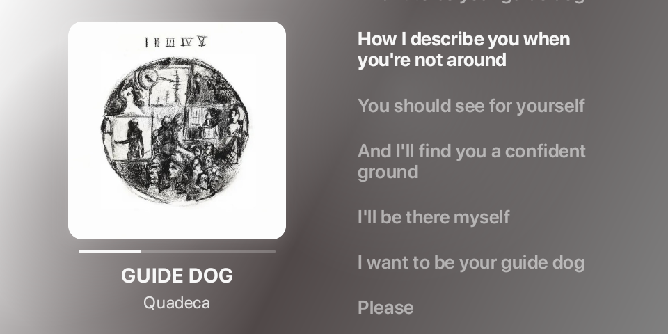

<p align="center">
	
</p>

<div class="header" align="center">

# sview
Built for jailbroken Amazon Echo Shows to display Spotify now-playing info

</div>

> [!IMPORTANT]
> Requires Spotify to be installed and logged in on the device

## What it does
- Shows currently playing track/artist/artwork from Spotify
- Fetches lyrics from [LRCLIB](https://lrclib.net/) API and displays them

## What it doesn’t do
- No audio playback, casting, or transport outside what Spotify already provides

## Building
```bash
./gradlew :app:assembleRelease
```
The GitHub Action in `.github/workflows/android-apk.yml` also produces a signed release APK when provided with signing secrets

## Requirements
- Android 11+ (minSdk 30) on a jailbroken Amazon Echo Show
> Find out how to jailbreak your Echo Show on [XDA Forums](https://xdaforums.com/f/amazon-echo.6148/)
- Spotify app installed and logged in
